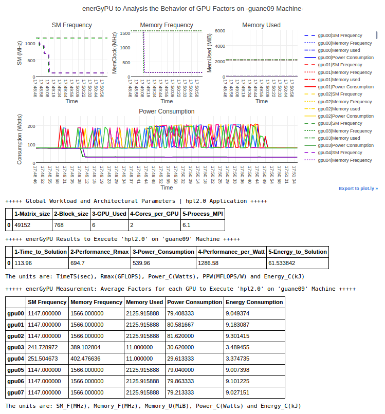

# enerGyPU Monitor for power consumption on Multi-GPU

enerGyPU main goal is to characterize the workload tasks and improve the balance between performance and energy-efficient.
enerGyPU is a batch monitor formed by two levels: 
1) The firts level automate the nvidia-smi queries to capture the power traces in runtime: in which the main launcher executes the ```energypu_record.sh``` in parallel with the scientific-application and write the GPU architectural factors.
2) The second level is a data visualization for analyzing the GPU architectural factors and model prediction system (EEA-Aware) for obtaining the optimal computational resources in a stactic time.

## enerGyPU example on multi-GPU node:
The experimental procedures were executed with aset of test of HPL code variants using 6 GPUs on multi-GPU node.  
<p align="center"></p>
Work presented on Supercomputer Conference 2016; EEA-Aware for Large-Scale Scientific Applications on Heterogeneous Architectures.

## Paper
If you use enerGyPU monitor, please cite [this paper](https://ieeexplore.ieee.org/document/7515761)
```
@inproceedings{energypu,
  title={enerGyPU and enerGyPhi Monitor for Power Consumption and Performance Evaluation on Nvidia Tesla GPU and Intel Xeon Phi},
  author={John A. Garcia H., Esteban Hernandez B., Carlos E. Montenegro, Philippe O. Navaux, Carlos J. Barrios H.},
  booktitle = "{https://ieeexplore.ieee.org/document/7515761}",
  year={2016}
}
```

## Project
enerGyPU Monitor was part of the master research work: [Energy-Aware EEA for Large-Scale Scientific Applications on Heterogeneous Architectures](https://www.researchgate.net/publication/309742476_Energy-Aware_EEA_for_Large-Scale_Scientific_Applications_on_Heterogeneous_Architectures) (2016).

## References
1) John A. G. Henao, Victor M. Abaunza, Philippe O. A. Navaux, Carlos J. B. Hernandez.
[eGPU for Monitoring Performance and Power Consumption on Multi-GPUs.](https://www.researchgate.net/publication/296531795_enerGyPU_and_enerGyPhi_Monitor_for_Power_Consumption_and_Performance_Evaluation_on_Nvidia_Tesla_GPU_and_Intel_Xeon_Phi) (2015).

## Help
Start an issue if you find a bug or would like to contribute!
For other matters, you can contact [@jagh](https://github.com/jagh).
